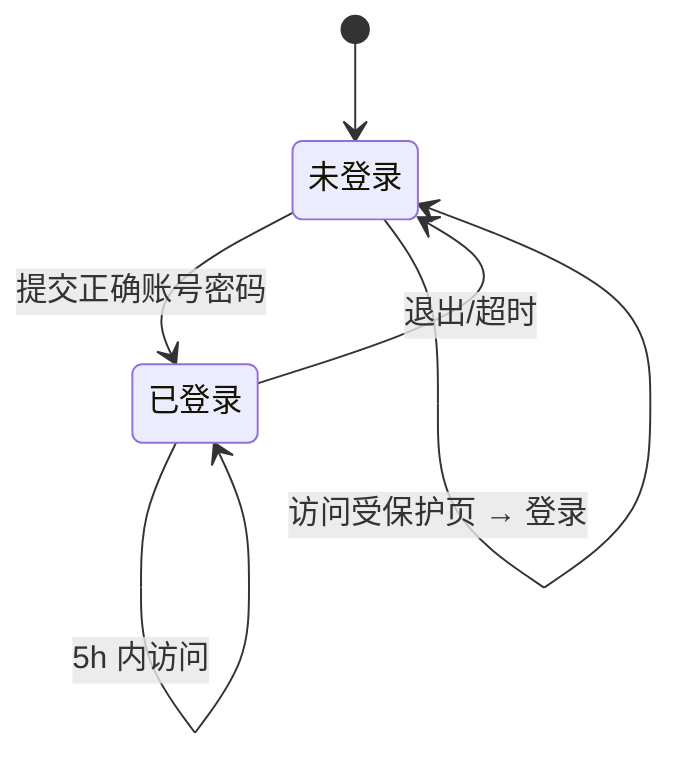

# 项目管理系统 — 产品需求文档（PRD）

**版本**：整合稿（主文档 + 附录 A）  
**最后更新**：2026-04-23  

---

## 文档信息

| 项目 | 说明 |
|------|------|
| 系统名称 | 项目管理系统 |
| 文档类型 | 产品需求说明 + 字段字典/状态机/线框图附录 |
| 文档状态 | 草案 |

---

## 1. 概述

### 1.1 建设目标

在统一系统内，规范化管理各产品项目相关文件（如产品原型、需求文档等），避免各项目使用不同目录与方式存放，导致查找困难、版本混乱、协作成本高等问题。

### 1.2 范围（本期）

- 以「项目管理」为唯一一级菜单，包含两个二级页面：「项目概况」「需求文档管理」。
- 提供基础登录/退出与登录态保持能力。

---

## 2. 需求背景

- 多项目、多文件分散在不同地方或个人习惯目录中，缺乏统一规范。
- 缺少统一入口查看「项目 + 版本 + 文档」的对应关系，协同与交接成本高。
- 需一处维护项目元信息，并关联到文档目录，便于按项目/版本快速定位需求文档。

---

## 3. 假设与约束

- **用户模型**：先支持单账号或少量内置账号，本期明确给出测试账号，后续可扩展鉴权与多用户。
- **文件存储**：需求文档为上传文件，需有服务端存储、命名与元数据记录（具体由技术方案确定）；预览能力依赖可预览格式与浏览器/服务组件能力。
- **时间**：「登录态维持 5 小时」为产品规则，由会话/令牌策略实现。

---

## 4. 用户与登录（先行约定）

| 项 | 说明 |
|----|------|
| 登录名 | `admin` |
| 密码 | `12345`（仅作本期演示/内测，上线前需替换策略） |
| 昵称 | 系统管理员 |
| 未登录 | 除登录页外，不得访问系统功能页，访问应被重定向至登录页。 |

**登录态**：登录成功后 5 小时内有效；超时需重新登录（具体以会话过期或静默续期是否允许由产品确认；当前描述为「可维持 5 小时」）。

---

## 5. 信息架构与全局布局

### 5.1 菜单与布局

- **结构**：共二级菜单，在**左侧边栏**展示；边栏**支持折叠/展开**。
- **内容区**：选中菜单后，在**右侧以标签页（Tab）**打开该二级菜单对应页面；**标签页标题 = 该二级菜单名称**。
- **当前一级菜单**：`项目管理`  
- **当前二级菜单**：
  1. `项目概况`  
  2. `需求文档管理`  

（后续若增加一级/二级菜单，应沿用相同交互模式。）

### 5.2 已登录后顶部/右上角

- 显示 **圆形头像**（默认取**昵称首字**） + **昵称**。
- 点击头像出**下拉菜单**，项：**退出登录**。
- 选择「退出登录」后：**清除登录态**，**跳转回登录页**。

---

## 6. 功能需求详述

### 6.1 二级菜单：项目管理 → 项目概况

**定位**：以表格形式管理项目主数据，并作为跳转「需求文档」的入口之一。

#### 6.1.1 项目信息列表

- 以**分页表格**展示项目列表。

**列表字段**（列）包括：

| 列名 | 说明 |
|------|------|
| 项目名称 | 文本 |
| 版本号 | 文本 |
| 项目经理 | 文本 |
| 需求部门 | 文本 |
| 描述 | 可长文本/摘要 |
| 需求文档 | 表示与文档的关联，见 6.1.4 |
| 操作 | 本行数据相关操作，见 6.1.3 |

#### 6.1.2 表格区域外的操作

- **查询**：在表格**上方**独立按钮（或带输入区的查询区），支持按以下条件 **模糊** 搜索：  
  - 项目名称  
  - 项目经理  
  - 版本号  
  - 需求部门  
- **新增**：在表格**上方**独立按钮，打开**新增**弹窗。

#### 6.1.3 行内操作（操作列）

- **修改**：打开**编辑**弹窗，**回显**当前行已录入信息。  
- **删除**：**二次确认**——弹出对话框，询问是否删除，**用户确认**后才执行删除。

#### 6.1.4 新增 / 修改 弹窗

- **触达**：「新增」或行内「修改」。
- **回显/录入**：除必填校验外，展示/编辑与列表一致的信息维度；**需求文档**在弹窗中采用 **「标签块」** 式展示已关联文档（可理解为标签/卡片列表，便于多文档展示与区分）。
- **需求文档录入方式**：通过 **上传文件** 添加（可多文件、数量与大小限制由评审与方案确定）。
- **校验（必填）**：  
  - 项目名称  
  - 项目版本（若与「版本号」为同一业务含义，可合并为一个字段在 PRD/原型中避免重复）  
  - 项目经理  
  - 版本号（若与「项目版本」重复，建议评审时合并为单字段，避免双字段语义冲突）

> **说明**：若「项目版本」与「版本号」为同一概念，建议统一为「版本号」一项必填；若为业务版本与技术版本两类，需分别定义。此处先按原需求保留，待产品定稿时合并或拆分。

#### 6.1.5 「需求文档」列与跨页跳转

- 列表**每一行**的 **需求文档** 列提供 **「文档查看」类入口**（如链接或按钮）。
- 行为：跳转至 **二级菜单「需求文档管理」** 页，并 **定位到** 与该项目/版本/文档对应的 **需求文档目录**（与 6.2 目录树「项目名称 → 版本号 → 需求文档」结构一致，确保打开后选中的树节点、右侧表单与目标文档所在目录一致）。

**验收要点**：从项目 A 的某行进入，目录树高亮/展开至「项目 A → 对应版本 → 目标目录」，右侧列表展示该目录下文档。

---

### 6.2 二级菜单：项目管理 → 需求文档管理

**定位**：以「目录树 + 文档表」管理所有需求文档的归属与操作。

#### 6.2.1 页面结构（两栏）

- **左**：**需求文档目录树**  
- **右**：**当前选中目录** 对应的 **文档表单/列表**  

仅当选中某目录时，右侧展示其内容；切换目录时右侧刷新。

#### 6.2.2 目录树结构

- 树形结构：**项目名称 → 版本号 → 需求文档**（第三层为需求文档相关节点，表示该版本下的文档目录或分组；具体是文件夹还是文档集合由技术实现，产品呈现为可展开节点直至文档所在层级）。
- 与 6.1.5 联动：从项目概况跳转时，**自动定位**到与该项目、版本、文档位置一致的节点。

#### 6.2.3 右侧：当前目录有文档

展示 **当前目录下** 的文档 **列表/表格**，字段包括：

| 列名 | 说明 |
|------|------|
| 文档名称 | 文件名或业务名 |
| 项目名称 | 冗余展示便于跨目录核对 |
| 版本号 | 与目录第二级一致 |
| 项目经理 | 来自项目或元数据 |
| 需求部门 | 来自项目或元数据 |
| 上传人 | 上传者账号或昵称 |
| 更新时间 | 最后更新时间 |
| 操作 | 见下表 |

**操作列**：

| 操作 | 行为 |
|------|------|
| 预览 | 在 **右侧** 弹窗/抽屉内做文件预览。支持格式：rp、Excel、Word、HTML、PPT、PDF、ZIP 等。若**不支持**当前文件类型，展示：「不支持当前文件格式预览，请下载后在本地打开」。 |
| 下载 | 将文件**下载到本地**（浏览器下载） |
| 删除 | **二次确认**对话框，确认后删除；列表刷新 |
| 更新 | 选择本地文件 **覆盖当前文件**；上传成功后**刷新**当前目录文档列表 |

> 产品允诺的「支持」范围在开发阶段以实际可行为准；不支持的类型走统一不预览文案。

#### 6.2.4 右侧：当前目录无文档

- 主文案：`当前目录下无需求文档`  
- 提供按钮：**立即上传**  
- 行为：选择本地文件上传到**当前目录**，上传成功后**刷新**右侧列表（进入 6.2.3 有文档态）。

---

## 7. 非功能与交互要求

| 类别 | 要求 |
|------|------|
| 安全与登录 | 需登录后访问；退出清除会话并回登录页；密码不在对外环境明文硬编码 |
| 会话 | 登录有效时长 **5 小时**（产品规则） |
| 体验 | 侧边栏折叠；Tab 与二级菜单名一致；删除类操作二次确认 |
| 可访问性/国际化 | 本期以中文为主 |

---

## 8. 待产品确认点

1. 「**项目版本**」与「**版本号**」是否同一字段；列表与表单是否去重。  
2. 需求文档在树第三层是单文档还是多文档/文件夹；「立即上传」是否支持批量。  
3. 从项目概况跳转的「精确定位」：定位到**目录**还是**具体文件**（原需求强调「需求文档目录」为目录级）。  
4. 可预览格式边界：例如 rp、旧版 Office、ZIP 的列表或禁止预览。  
5. 后续多用户、角色、审计、存储配额为二期，本期不写死。

---

## 9. 需求追溯简表

| 编号 | 需求点 | 对应章节 |
|------|--------|----------|
| R-01 | 统一管项目与文档 | §2、§1 |
| R-02 | 侧栏二级菜单 + Tab、可折叠 | §5.1 |
| R-03 | 项目 CRUD、模糊查、行内改删、弹窗与上传 | §6.1 |
| R-04 | 从项目跳需求文档并定位 | §6.1.5、§6.2.2 |
| R-05 | 树+列表、预览/下载/删/更、空态上传 | §6.2 |
| R-06 | 登录/退出/头像/5h | §4、§5.2、§7 |

---

## 附录 A：字段字典、状态机与线框图说明

### A.1 字段字典

#### A.1.1 项目（项目概况主实体）

| 逻辑字段 | 界面/列表 | 数据类型 | 必填 | 说明与约束 |
|----------|-----------|----------|------|------------|
| 项目名称 | 是 | 文本，建议 1～128 字 | 是 | 查询条件之一（模糊） |
| 项目版本 / 版本号 | 是（待统一命名） | 文本，建议 1～64 字 | 是 | 与目录树第二级「版本号」一致；可合并为单字段 |
| 版本号 | 是 | 文本 | 是* | 若与「项目版本」合并则仅保留一项 |
| 项目经理 | 是 | 文本 | 是 | 查询（模糊） |
| 需求部门 | 是 | 文本 | 否* | 查询（模糊）；无说明时按可选，待定稿 |
| 描述 | 是 | 长文本 | 否 | 可摘要，弹窗全显 |
| 需求文档 | 是 | 关联/附件 | 视业务 | 多文件时标签块展示；需文件与目录的映射关系 |

\* **评审定稿**：「项目版本」与「版本号」去重后必填项；需求部门是否必填。

#### A.1.2 用户与登录

| 逻辑字段 | 用途 | 数据类型 | 说明 |
|----------|------|----------|------|
| 账号 | 登录 | 文本 | 本期 `admin` |
| 密码 | 登录 | 密文/哈希 | 不得明文存库；演示密码仅联调 |
| 昵称 | 展示/头像 | 文本 | 首字作默认头像字 |
| 登录态/令牌 | 5 小时 | 会话或 JWT+过期 | 同 §4、§7 |

#### A.1.3 需求文档（文档表单行）

| 逻辑字段 | 列表列 | 数据类型 | 说明 |
|----------|--------|----------|------|
| 文档名称 | 是 | 文本 | 展示用 |
| 项目名称 | 是 | 外键/冗余 | 与项目一致 |
| 版本号 | 是 | 文本 | 与目录第二级一致 |
| 项目经理 | 是 | 外键/冗余 | 自项目或快照 |
| 需求部门 | 是 | 外键/冗余 | 自项目或快照 |
| 上传人 | 是 | 文本/ID | 当前用户 |
| 更新时间 | 是 | 日期时间 | 更新后刷新 |
| 文件引用 | 否（隐含） | 存储 | 预览、下载、更新、删除用 |

#### A.1.4 目录树节点（逻辑结构）

| 层级 | 节点含义 | 关键标识 | 子级 |
|------|----------|----------|------|
| 1 | 项目 | 项目名称 | 多个版本节点 |
| 2 | 版本 | 版本号（+ 项目 ID） | 多个第三层 |
| 3 | 需求文档层 | 与业务约定 | 下挂文件或空 |

从**项目概况 → 文档查看** 跳转时，需带**项目、版本、目标目录/文档** 参数以正确定位。

---

### A.2 状态机

#### A.2.1 用户会话



| 状态 | 可访问内容 |
|------|------------|
| 未登录 | 仅登录 |
| 已登录 | 全部已授权功能 |

#### A.2.2 主界面 Tab（与二级菜单联动）

产品形态可为「**单 Tab 与侧栏一一对应**（仅两页时推荐）」或**多 Tab**；多 Tab 时，Tab 标题=二级菜单名。状态转换要点：

- 点侧栏二级菜单：打开或切换对应 Tab 内容区。  
- 点「退出登录」：从「已登录」回「未登录」。

#### A.2.3 删除确认（项目行 / 文档行）

- **初始** → 点**删除** → **待确认对话**；**确认**后请求接口，**成功**回列表**常显**；**取消**回**常显**；失败则提示并**保持常显**。

#### A.2.4 需求文档管理—右侧

- **未选目录**：不展示文档表仅提示选目录（若产品无此步则一进入即选默认根）。  
- **已选目录-无文档**：空态 +「立即上传」。  
- **已选目录-有文档**：表 + 行操作。  
- **上传/更新成功**：无文档态 → 有文档态 或 刷新有文档态。  
- **全部删除**：若有文档可删至 0 条，有文档态可回到无文档态。

（具体是否「必须选树节点再显右侧」以交互稿为准。）

---

### A.3 线框图说明（低精度文字布局）

#### A.3.1 登录页

```
┌────────────────────────────────────────────┐
│              项目管理系统                    │
│                                            │
│         账号    [        input         ]  │
│         密码    [  •••••  password     ]  │
│                                            │
│                 [ 登  录 ]                 │
└────────────────────────────────────────────┘
```

#### A.3.2 主壳（已登录）

- **顶栏**：系统名/折叠按钮；**右上**：头像+昵称，下拉**退出登录**。  
- **左侧**：可折叠边栏，一级「项目管理」下二级**项目概况、需求文档管理**。  
- **主区上**：**Tab 条**（Tab 文=二级菜单名）。  
- **主区下**：当前 Tab 的页面块。

#### A.3.3 项目概况

- **上**：**查询区**（名称、经理、版本、部门 模糊 + **查询** 按钮） + **+ 新增项目**。  
- **中**：**分页表**（列含 需求文档 + 操作[改/删]）。  
- **弹窗**：**必填**项与需求文档**标签块** + **上传** + 确定/取消。  

#### A.3.4 需求文档管理

- **左约 1/4**：**目录树**（项目→版本→需求文档层）。  
- **右约 3/4**：当前目录下**文档表**（**预览/下载/删/更**）；无文档为提示 + **立即上传**；**预览**为右侧弹层/抽屉。

---

*— 本文档为 Markdown/Word 同期导出稿；Mermaid 图在 Word 中需依赖后续插件或转图后再嵌入方可渲染。*
