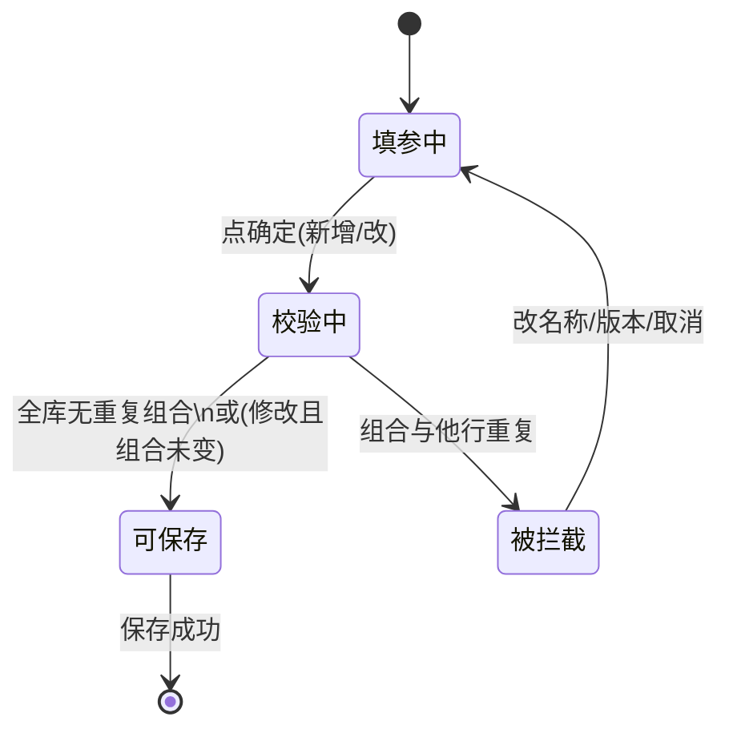
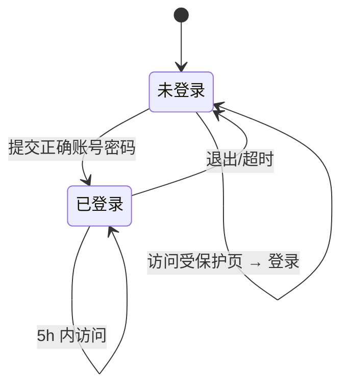

# 项目管理系统 — 产品需求文档（PRD）

**版本**：整合稿（主文档 + 附录 A）  
**最后更新**：2026-12-20  
**修订说明**：已纳入 (1) 项目名称+版本号全库唯一与表单校验 (2) 支持文件夹上传及可延展的目录树 (3) 从项目概况跳转到「版本号」二级目录节点 (4) 需求文档管理右侧展示当前选中目录及其子目录下的文件 (5) 级联删除仅作用于项目概况的项目删除 (6) 上传文件夹/大目录时的数量、大小与重名规则。  

---

## 文档信息

| 项目 | 说明 |
|------|------|
| 系统名称 | 项目管理系统 |
| 文档类型 | 产品需求说明 + 字段字典/状态机/线框图附录 |
| 文档状态 | 草案 |

---

## 1. 概述

### 1.1 建设目标

在统一系统内，规范化管理各产品项目相关文件（如产品原型、需求文档等），避免各项目使用不同目录与方式存放，导致查找困难、版本混乱、协作成本高等问题。

### 1.2 范围（本期）

- 以「项目管理」为唯一一级菜单，包含两个二级页面：「项目概况」「需求文档管理」。
- 提供基础登录/退出与登录态保持能力。

---

## 2. 需求背景

- 多项目、多文件分散在不同地方或个人习惯目录中，缺乏统一规范。
- 缺少统一入口查看「项目 + 版本 + 文档」的对应关系，协同与交接成本高。
- 需一处维护项目元信息，并关联到文档目录，便于按项目/版本快速定位需求文档。

---

## 3. 假设与约束

- **用户模型**：先支持单账号或少量内置账号，本期明确给出测试账号，后续可扩展鉴权与多用户。
- **文件存储**：需求文档为上传**文件**或**文件夹**（文件夹上传在客户端按**目录树**或**多文件+路径**还原结构，**具体能力以浏览器/系统 API 与实现方案为准**）；需有服务端存储、命名与元数据记录；预览能力依赖可预览格式与浏览器/服务组件能力。
- **时间**：「登录态维持 5 小时」为产品规则，由会话/令牌策略实现。
- **数据主键/唯一性**：**「项目名称 + 版本号」** 在全库**唯一**对应**一条**项目记录；**不存在**相同组合的两条及以上记录。落地方式可为数据库唯一约束 + 前端的**新增/修改**校验与提示，见 **§6.1.4、§6.1.1** 说明。

---

## 4. 用户与登录（先行约定）

| 项 | 说明 |
|----|------|
| 登录名 | `admin` |
| 密码 | `12345`（仅作本期演示/内测，上线前需替换策略） |
| 昵称 | 系统管理员 |
| 未登录 | 除登录页外，不得访问系统功能页，访问应被重定向至登录页。 |

**登录态**：登录成功后 5 小时内有效；超时需重新登录（具体以会话过期或静默续期是否允许由产品确认；当前描述为「可维持 5 小时」）。

---

## 5. 信息架构与全局布局

### 5.1 菜单与布局

- **结构**：共二级菜单，在**左侧边栏**展示；边栏**支持折叠/展开**。
- **内容区**：选中菜单后，在**右侧以标签页（Tab）**打开该二级菜单对应页面；**标签页标题 = 该二级菜单名称**。
- **当前一级菜单**：`项目管理`  
- **当前二级菜单**：
  1. `项目概况`  
  2. `需求文档管理`  

（后续若增加一级/二级菜单，应沿用相同交互模式。）

### 5.2 已登录后顶部/右上角

- 显示 **圆形头像**（默认取**昵称首字**） + **昵称**。
- 点击头像出**下拉菜单**，项：**退出登录**。
- 选择「退出登录」后：**清除登录态**，**跳转回登录页**。

---

## 6. 功能需求详述

### 6.1 二级菜单：项目管理 → 项目概况

**定位**：以表格形式管理项目主数据，并作为跳转「需求文档」的入口之一。

#### 6.1.1 项目信息列表

- 以**分页表格**展示项目列表。
- **业务唯一性**：**「项目名称 + 版本号」** 组合在**全系统**内**唯一**；**不允许**存在两条及以上**相同组合**的项目记录（与 **§6.1.4** 中新增/修改唯一性校验一致）。

**列表字段**（列）包括：

| 列名 | 说明 |
|------|------|
| 项目名称 | 文本 |
| 版本号 | 文本 |
| 项目经理 | 文本 |
| 需求部门 | 文本 |
| 描述 | 可长文本/摘要 |
| 需求文档 | 表示与文档的关联，见 6.1.4 |
| 操作 | 本行数据相关操作，见 6.1.3 |

#### 6.1.2 表格区域外的操作

- **查询**：在表格**上方**独立按钮（或带输入区的查询区），支持按以下条件 **模糊** 搜索：  
  - 项目名称  
  - 项目经理  
  - 版本号  
  - 需求部门  
- **新增**：在表格**上方**独立按钮，打开**新增**弹窗。

#### 6.1.3 行内操作（操作列）

- **修改**：打开**编辑**弹窗，**回显**当前行已录入信息。  
- **删除**：**二次确认**——弹出对话框，询问是否删除，如果当前项目下有关联需求文档，则额外提示会删除该项目下需求文档，**用户确认**后才执行删除；**级联删除提示及策略仅适用于此处的项目删除操作**，本期**不提供**「需求文档管理」中**文件夹/目录节点删除**能力。

#### 6.1.4 新增 / 修改 弹窗

- **触达**：「新增」或行内「修改」。
- **回显/录入**：除必填校验外，展示/编辑与列表一致的信息维度；**需求文档**在弹窗中采用 **「标签块」** 式展示已关联文档（可理解为标签/卡片列表，便于多文档展示与区分；**标签块可做删除操作，删除即删除对应需求文档**）。
- **需求文档录入方式**：通过 **上传文件**、**上传文件夹** 或 **上传大目录** 添加；**批量上传**时，按**实际文件数**统计，**单次上传总文件数不超过 20 个**、**总大小不超过 100M**；若上传**文件夹/大目录**则按**本地结构**在对应**版本目录**下**还原/合并**为子目录与文件（与 **§6.2.2** 可延展树一致）；若出现**重名文件**或**重名文件夹**，系统自动在重名对象后追加 **`-副本`** 后缀完成重命名。
- **校验（必填）**：  
  - 项目名称  
  - 版本号（与「项目名称」共同构成**业务主键**）  
  - 项目经理  

- **「项目名称 + 版本号」唯一性校验**（**新增**与**修改**均须执行）：
  - **保存前**（点击「确定」时）在**全库**检查是否已存在**相同「项目名称 + 版本号」** 的组合。
  - **新增**：若已存在，**禁止保存**，**提示**（示例）：「已存在相同项目名称与版本号的项目，请修改名称或版本号后重试。」
  - **修改**：若用户将**项目名称**或**版本号**改为与**其他行**已存在的组合**重复**，**禁止保存**，**提示**同上；若**未改**该组合，仅改其他字段，**应允许**保存。

> **说明**：列表中「项目名称」与「版本号」为两个独立展示字段，**业务上**以二者组合唯一标识一个项目行。

#### 6.1.5 「需求文档」列与跨页跳转

- 列表**每一行**的 **需求文档** 列提供 **「文档查看」类入口**（如链接或按钮）。
- **跳转目标**（**明确**）：**切换/打开** **「需求文档管理」** 标签页，在**目录树**中选中 **「项目名称」→「该行的版本号」** 对应的 **第 2 层节点**（与 **6.2** 节中 **项目 → 版本** 树结构一致，即该项目下该**版本**文档的**根目录**节点）。**不**自动下钻到更**深层**子目录，用户可在**左树**中自行展开**子文件夹**；**右表**展示该**版本号**目录及其**子目录**下的文件内容，具体规则见 **§6.2.3/6.2.4**。
- **行为补充**：树**高亮/展开** 至该**版本号** 节点后，**该节点及其子目录**下的**文件**进入**右侧**表格，**子文件夹**本身仍只出现在**左侧**树中，分工见 **§6.2.3**。

**验收要点**：从项目 A、版本 V 的一行点「文档查看」，应看到目录树**高亮/展开**到 **项目 A 下的「版本 V」** 这一层，右侧为**该版本节点及其子目录**下的文件内容；若该版本下只有子文件夹而暂无任何文件，则右侧按 **§6.2.4** 显示空态。

---

### 6.2 二级菜单：项目管理 → 需求文档管理

**定位**：以「目录树 + 文档表」管理所有需求文档的归属与操作。

#### 6.2.1 页面结构（两栏）

- **左**：**需求文档目录树**  
- **右**：**当前选中目录及其子目录下文件** 对应的 **文档表单/列表**  

仅当选中某目录时，右侧展示该目录及其子目录下的文件内容；切换目录时右侧刷新。

#### 6.2.2 目录树结构

- **根结构**：**第 1 层** 为 **项目名称**；**第 2 层** 为 **版本号**（**即与 §6.1.5 跳转目标对应的「二级目录」**——某项目下某一版本的根）。
- **第 3 层及以深**：在「版本号」下，**既可以** 直接挂**单个/多个**需求文档**文件**节点，**也可以** 挂**文件夹**节点。文件夹**可以嵌套**（**子文件夹下**还可继续有文件或**更深**子目录），**目录树在深度上可延展**；**不存在**只能固定三层的限制。
- **与上传的关系**：**上传文件** 或**上传文件夹** 时，当前选中目录为**落点**；**上传文件夹** 时，以选定目录为根，在下方**按本地文件夹结构**创建/合并子树。
- 与 6.1.5 联动：从项目概况**文档查看**跳转时，**定位**到**第 2 层「该项目的该版本号」**节点，**不**再向下自动定位到某一条深层路径，除非**后续**产品单独立项「跳转到具体子路径」能力。

#### 6.2.3 右侧：当前「选中目录」及其子目录下挂有文件

说明：**「当前目录」** 在逻辑上**等于** 树中**选中的**节点所代表的**目录**（**版本号**节点、或**某子文件夹**节点均适用）。当**当前选中目录本身**或其**任意子目录**下**存在文件**时，右侧表格需**汇总列出这些文件**；**不**在表格中**重复**列出**子文件夹**本身，子文件夹仅显示在**左侧树**中，作为导航定位使用。

展示 **当前目录及其子目录下**的 **文件** **列表/表格**，字段包括：

| 列名 | 说明 |
|------|------|
| 文档名称 | 文件名或业务名 |
| 项目名称 | 冗余展示便于跨目录核对 |
| 版本号 | 与目录第二级一致 |
| 项目经理 | 来自项目或元数据 |
| 需求部门 | 来自项目或元数据 |
| 上传人 | 上传者账号 |
| 更新时间 | 最后更新时间 |
| 操作 | 见下表 |

**操作列**：

| 操作 | 行为 |
|------|------|
| 预览 | 在 **右侧** 弹窗/抽屉内做文件预览。支持格式：rp、Excel、Word、HTML、PPT、PDF、ZIP 等。若**不支持**当前文件类型，展示：「不支持当前文件格式预览，请下载后在本地打开」。 |
| 下载 | 将文件**下载到本地**（浏览器下载） |
| 删除 | **二次确认**对话框，确认后删除；列表刷新 |
| 更新 | 选择本地**文件** **覆盖当前文件**（对表格中的**行**=文件）；**不支持** 用一次「更新」替换整**文件夹**节点，子目录变更通过新增上传处理 |

> 产品允诺的「支持」范围在开发阶段以实际可行为准；不支持的类型走统一不预览文案。  
> **注**：**文件夹** 节点**无** **预览** 行为，且**本期不上线文件夹/目录节点删除能力**；删除确认与级联删除策略**仅**适用于 **§6.1.3** 的项目删除。

#### 6.2.4 右侧：当前目录及其子目录下均无文件

- 若**当前节点**为**空目录**，且其**所有子目录**下也**无任何文件**，主文案：`当前目录下无需求文档`。
- **立即上传** 支持**多文件**、**文件夹**或**大目录**；按**实际文件数**统计，**单次上传总文件数不超过 20 个**、**总大小不超过 100M**，与 **§6.1.4** 中弹窗上传规则一致。
- 若上传过程中出现**重名文件**或**重名文件夹**，系统自动在重名对象后追加 **`-副本`** 后缀完成重命名。
- 上传**成功** 后**刷新** **左树** 与**右侧** **列表**；若当前目录或其子目录下出现文件，右侧按 **§6.2.3** 展示汇总文件列表。

---

## 7. 非功能与交互要求

| 类别 | 要求 |
|------|------|
| 安全与登录 | 需登录后访问；退出清除会话并回登录页；密码不在对外环境明文硬编码 |
| 会话 | 登录有效时长 **5 小时**（产品规则） |
| 体验 | 侧边栏折叠；Tab 与二级菜单名一致；删除类操作二次确认；需求文档管理右侧按“当前选中目录及其子目录下文件”展示 |
| 可访问性/国际化 | 本期以中文为主 |

---

## 8. 待产品确认点

1. 可预览格式边界：例如 rp、旧版 Office、ZIP 的列表或禁止预览。  
2. 已确认：级联删除提示及策略**仅体现在「项目概况」中的项目删除操作**；本期**不上线**「需求文档管理」里的**文件夹/目录节点删除**操作。  
3. 已确认：支持上传**文件夹**或**大目录**；按**实际文件数**统计，**单次上传总文件数不超过 20 个**、**总大小不超过 100M**；若出现**重名文件**或**重名文件夹**，系统自动在原名称后追加 **`-副本`** 后缀。  
4. 后续多用户、角色、审计、存储配额为二期，本期不写死。

> **本版已纳入**：（1）**项目名称+版本号** 全库**唯一** 与**新增/修改表单校验及提醒**；（2）**文件/文件夹**上传与**可嵌套延展**的目录树；（3）从项目概况跳至需求文档时，**仅**定位到项目下**该版本号**对应的第二层目录节点，**不**自动深入更深子路径；（4）需求文档管理右侧展示**当前选中目录及其子目录下**的文件；（5）级联删除提示及策略仅作用于**项目概况的项目删除**；（6）上传文件夹或大目录时，单次上传**总文件数不超过 20 个**、**总大小不超过 100M**，重名自动追加 **`-副本`**。

---

## 9. 需求追溯简表

| 编号 | 需求点 | 对应章节 |
|------|--------|----------|
| R-01 | 统一管项目与文档 | §2、§1 |
| R-02 | 侧栏二级菜单 + Tab、可折叠 | §5.1 |
| R-03 | 项目 CRUD、模糊查、行内改删、弹窗与上传 | §6.1 |
| R-04 | 从项目跳**需求文档管理**并**定位**至 **项目→版本号(二级目录)** | §6.1.5、§6.2.2 |
| R-05 | 树+列表、预览/下载/删/更、空态上传；文件夹与可嵌套目录；上传文件夹 | §6.2、§3 |
| R-06 | 登录/退出/头像/5h | §4、§5.2、§7 |
| R-07 | 「项目名称+版本号」全库唯一、新增/修改唯一性校验与提示 | §3、§6.1.1、§6.1.4 |
| R-08 | 从项目跳转到「项目→版本号」二级目录、右侧展示该层内容 | §6.1.5、§6.2.2 |

---

## 附录 A：字段字典、状态机与线框图说明

### A.1 字段字典

#### A.1.1 项目（项目概况主实体）

| 逻辑字段 | 界面/列表 | 数据类型 | 必填 | 说明与约束 |
|----------|-----------|----------|------|------------|
| 项目名称 | 是 | 文本，建议 1～128 字 | 是 | 与「版本号」**组合**在**全库唯一**；查询条件（模糊） |
| 版本号 | 是 | 文本，建议 1～64 字 | 是 | 与**项目名称** 组合**唯一**；**对应** 需求文档树中**第 2 层**「该版本」**目录**；查询（模糊） |
| 项目经理 | 是 | 文本 | 是 | 查询（模糊） |
| 需求部门 | 是 | 文本 | 否* | 查询（模糊） |
| 描述 | 是 | 长文本 | 否 | 可摘要，弹窗全显 |
| 需求文档 | 是 | 关联/附件 | 视业务 | 标签块展示，可删**标签**=删**关联**文档**；**与** **该** **版本** **下** **目录/文件** **的** 映射 见 A.1.4 |
| **（业务）唯一性** | 规则/约束 | — | — | **（项目名称, 版本号）** 组合**全库**不得重复；**新增/修改** 时**校验** 与 **提示** 见 **§6.1.4**；需求部门是否**必填**可后续定稿。 |

#### A.1.2 用户与登录

| 逻辑字段 | 用途 | 数据类型 | 说明 |
|----------|------|----------|------|
| 账号 | 登录 | 文本 | 本期 `admin` |
| 密码 | 登录 | 密文/哈希 | 不得明文存库；演示密码仅联调 |
| 昵称 | 展示/头像 | 文本 | 首字作默认头像字 |
| 登录态/令牌 | 5 小时 | 会话或 JWT+过期 | 同 §4、§7 |

#### A.1.3 需求文档（文档表单行）

| 逻辑字段 | 列表列 | 数据类型 | 说明 |
|----------|--------|----------|------|
| 文档名称 | 是 | 文本 | 展示用 |
| 项目名称 | 是 | 外键/冗余 | 与项目一致 |
| 版本号 | 是 | 文本 | 与目录第二级一致 |
| 项目经理 | 是 | 外键/冗余 | 自项目或快照 |
| 需求部门 | 是 | 外键/冗余 | 自项目或快照 |
| 上传人 | 是 | 文本/ID | 当前用户 |
| 更新时间 | 是 | 日期时间 | 更新后刷新 |
| 文件引用 | 否（隐含） | 存储 | 预览、下载、更新、删除用 |

#### A.1.4 目录树节点（逻辑结构）

| 层级 | 节点含义 | 关键标识 | 子级 |
|------|----------|----------|------|
| 1 | 项目 | 项目名称 | 多个版本节点 |
| 2 | **版本号（二级目录/跳转落点）** | 项目内唯一、与**项目概况** 版本号 一致 | **多文件** 与/或**子文件夹** 节点（**可** **嵌套** **延展**） |
| ≥3 | 子目录或文件 | 与业务/存储约定 | **子文件夹** 可继续有子；**文件** 为叶节点，见 **§6.2.3** |

**项目概况 → 文档查看**：在树上**定位**到 **L1=项目、L2=该版本号** 节点，**不** 自动 下钻 到 更 深 子 级；**跳转/路由** 至少带 **项目 标识** 与 **该 版本** 的 **目录/节点 标识**（**或** 项目+版本 的** 组合 键，由** 技术 定**）。

---

### A.2 状态机

#### A.2.0 项目保存与「项目名+版本号」唯一性



#### A.2.1 用户会话



| 状态 | 可访问内容 |
|------|------------|
| 未登录 | 仅登录 |
| 已登录 | 全部已授权功能 |

#### A.2.2 主界面 Tab（与二级菜单联动）

产品形态可为「**单 Tab 与侧栏一一对应**（仅两页时推荐）」或**多 Tab**；多 Tab 时，Tab 标题=二级菜单名。状态转换要点：

- 点侧栏二级菜单：打开或切换对应 Tab 内容区。  
- 点「退出登录」：从「已登录」回「未登录」。

#### A.2.3 删除确认（项目行 / 文档行）

- **初始** → 点**删除** → **待确认对话**；**确认**后请求接口，**成功**回列表**常显**；**取消**回**常显**；失败则提示并**保持常显**。

#### A.2.4 需求文档管理—右侧

- **未选目录**：不展示文档表仅提示选目录（若产品无此步则一进入即选默认根）。  
- **已选目录-无文档**：若该目录及其子目录下均无文件，则空态 +「立即上传」。  
- **已选目录-有文档**：若该目录或其子目录下存在文件，则表 + 行操作。  
- **上传/更新成功**：无文档态 → 有文档态 或 刷新有文档态。  
- **全部删除**：若有文档可删至 0 条，有文档态可回到无文档态。

（具体是否「必须选树节点再显右侧」以交互稿为准。）

---

### A.3 线框图说明（低精度文字布局）

#### A.3.1 登录页

```
┌────────────────────────────────────────────┐
│              项目管理系统                    │
│                                            │
│         账号    [        input         ]  │
│         密码    [  •••••  password     ]  │
│                                            │
│                 [ 登  录 ]                 │
└────────────────────────────────────────────┘
```

#### A.3.2 主壳（已登录）

- **顶栏**：系统名/折叠按钮；**右上**：头像+昵称，下拉**退出登录**。  
- **左侧**：可折叠边栏，一级「项目管理」下二级**项目概况、需求文档管理**。  
- **主区上**：**Tab 条**（Tab 文=二级菜单名）。  
- **主区下**：当前 Tab 的页面块。

**补充**：在 **需求文档管理** 中，树为 **可嵌套** 的 **项目→版本→(文件|文件夹[→…] )** 结构，与 **§6.2.2** 一致。

#### A.3.3 项目概况

- **上**：**查询区**（名称、经理、版本、部门 模糊 + **查询** 按钮） + **+ 新增项目**。  
- **中**：**分页表**（列含 需求文档 + 操作[改/删]）。  
- **弹窗**：**必填** 项目名称、**版本号**、项目经理；**保存** 时 **(名称+版本号)** **唯一** 不通过则**拦截**+**提示**；需求文档**标签块** + **上传**（**文件/文件夹**）+ 确定/取消。  

#### A.3.4 需求文档管理

- **左约 1/4**：**目录树**（**项目→版本号(二级目录)→** 文件或**可嵌套** **文件夹**）。  
- **右约 3/4**：**当前选中目录及其子目录下文件** 的**表格** + **行操** 与 **§6.2.3/6.2.4** 一致；**可** **“立即上传”** **选** **文件/文件夹/大目录**；**预览** 为**右侧**弹层/抽屉（**仅** **对** **文件** **行** **有效**，本期**不提供**目录节点删除）。  

---

*— 本文档为 Markdown/Word 同期导出稿；Mermaid 图在 Word 中需依赖后续插件或转图后再嵌入方可渲染。*
